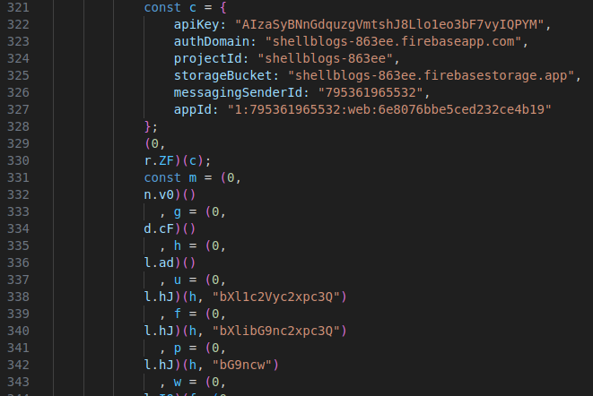

## Firebase Misconfiguration lead to reading admin sensitive data

The challenge was about exploiting a misconfigured **Firebase backend** exposed in a **Vue.js app**. First, I inspected the source code and found Firebase credentials directly hardcoded in the frontend. Using those credentials, I tried interacting with **Firestore** and discovered that user information could potentially be updated.

By observing the **network tab** while performing actions in the web app, I identified the exact method used to update user data and the structure of the request payload. I replicated that request using a custom **solve script**, authenticated with the Firebase credentials, and modified my user document by adding the `isAdmin` attribute and setting it to `true`. This successfully granted me admin access.

However, the challenge didn’t end there. After getting admin access and searching around the site, I couldn’t find the flag. I went back to the source code and noticed that **collection names were Base64-encoded** — for example, `myuserlist` appeared as `bXl1c2Vyc2xpc3Q`. I tried guessing other encoded names like `myflaglist`, but they didn’t work.

Digging deeper into the code, I eventually found a collection named `bG9ncw`, which decodes to `logs`. Reading from this collection revealed the flag:

```shellmates{f1r3$70r3_rul35_m15c0nf1gur4t10n5_g035_brrrrrrr}```


- Script used to update the user data: [here](./update.js)  
- Script used to read the logs: [here](./read_logs.js)  
- Source code: [here](./app.js)

---

### Fun fact

All what you need from the source code is in this 10 lines:

